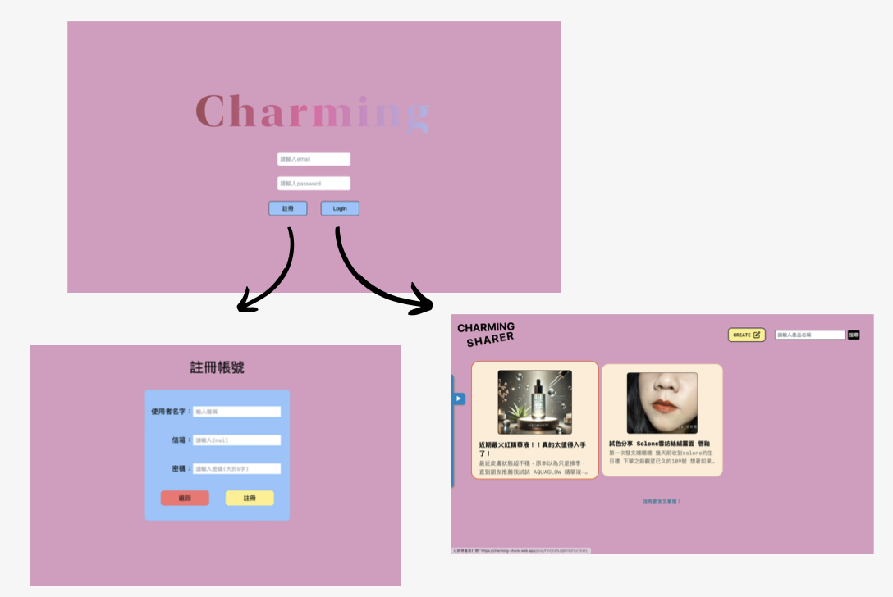

# Charming-Sharer

 
因為喜歡美妝，所以選擇打造一個美妝分享的平台。
 
在資訊爆炸的時代，希望美妝愛好者有一個可以輕鬆找到自己想要什麼的空間。
 
風格樣式以美式復古色系為主軸，參考美妝品牌ColourPop ( https://colourpop.com )。
 

## 索引
- [功能列表](#功能列表)
- [開發技能](#開發技能)
- [開發工具與部署](#開發工具與部署)
- [測試帳號](#測試帳號)
- [計畫未來會實現](#計畫未來會實現)
 

## 功能列表
 
- **響應式設計**
   
  支援電腦、平板、手機等裝置，避免遮擋資訊，提供不同螢幕尺寸下良好使用者體驗。
- **用戶註冊｜登入**
    
  創作者透過Email註冊帳號及登入帳號，登入後可以閱讀文章、發布文章及與其他創作者互動;若未登入則無法
  進入網站。
- **發佈｜編輯｜刪除文章**
    
  創作者可撰寫並發佈文章，分享自己的美麗心得，已發佈的文章可編輯或刪除。
- **文章留言、互動｜觀看次數**
    
  所有創作者皆可對文章進行留言、分享看法與建議;每篇文章有觀看次數的紀錄，方便創作者了解內容的受歡迎
  程度。
- **個人頁面展示**
    
  側邊欄裡的「My Story」可快速查看到自己發布的所有文章，文章內部點擊作者名稱也能連結到創作者的個人
  頁面，方便瀏覽此創作者其他文章。
- **側邊欄**
    
  側邊欄提供「回到首頁」、「My Story」及「登出」，操作簡單直觀，方便快速導航。
  
## 開發技能

**前端技能**
- **Vue 3** 
   
        採用現代化的 JavaScript 框架，支援組件化開發與響應式資料綁定。
- **Tailwind CSS** 
     
        快速排版，搭配元件拆分與路由規劃。
- **Vue Router** 
           
        負責前端頁面導覽，支援巢狀路由與動態路由功能，實現單頁應用的多視圖切換。
- **Pinia** 
    
       使用Pinia狀態管理，包含使用者登入登出狀態、初始驗證，結合 'localStorage' 實現登入狀態
       保持等功能以及搜尋條件保存。

- **Lazy Loading 懶加載** 
     
       定義路由時使用懶加載的技術，當使用者需要時才動態加載組件，減少初次加載所需時間 。
- **無限滾動** 
     
        一次載入限制為9篇文章，向下滾動到一定的高度時觸發載入更多資料， 避免一次載入過多資料造成效能
        負擔。

**後端技能**

- **Firebase** 
     
        使用 Firebase 提供的Firestore 做為後端資料庫，儲存文章內容、留言與使用者資料;
        透過Authentication實作會員登入、註冊系統、驗證及帳號刪除等功能。
- **Cloudinary** 
     
       支援撰寫文章圖片上傳，透過請求API上傳文章中的圖片，儲存至Cloudinary裡，回傳圖片 URL 儲存
       於資料庫中並於前端顯示。

  後端部分使用ChatGPT協助架設。
## 開發工具與部署
- **Vite**
   
  使用Vue搭配Vite快速建置專案，提供即時模組熱重載與高效能打包能力。
- **Firebase Hosting**
   
   透過 Firebase Hosting進行前後端部署。

## 測試帳號

**帳號** :test1@gmail.com
 
**密碼** :12345678

此帳號僅供測試！歡迎自行註冊帳號體驗！
 
## 計劃未來會實現

- 管理員帳號及權限
- 刪除文章後自動刪除Cloudinary資料庫內之圖片。
- 文章愛心數計算
- 創作者大頭貼放置

